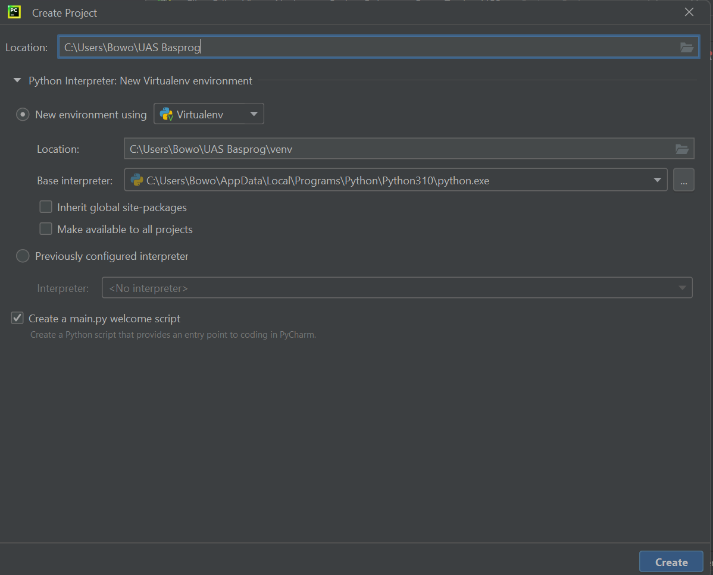
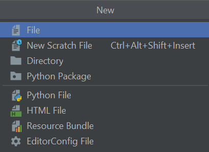
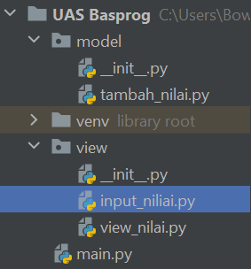
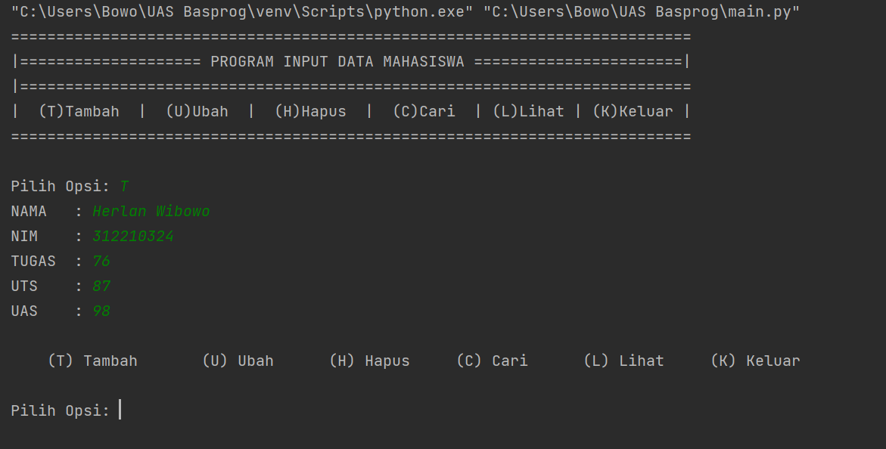
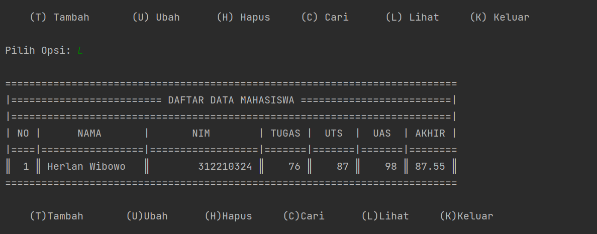
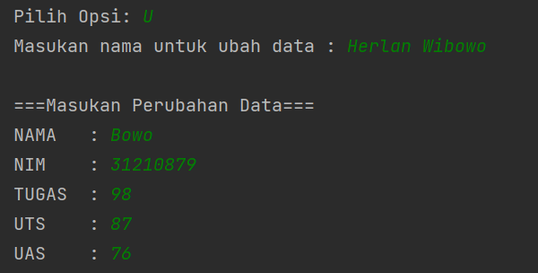
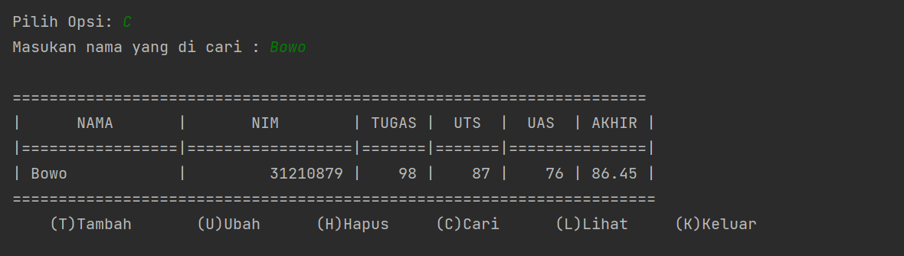
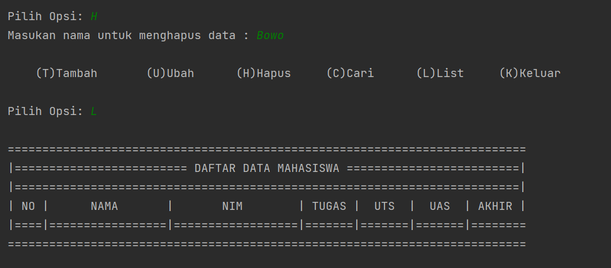
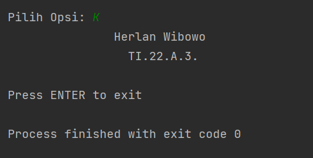

## Project-UAS
### Nama :Herlan Wibowo
### NIM  :312210324
### Kelas:TI 22 A3
### Link Youtube :https://youtu.be/28Epgna6mvs
### Link PDF :[link](https://github.com/HerlanWibowo/Project-UAS/blob/main/UAS%20Basprog.pdf)
### Buat program data Mahasiswa Mengggunakan Package dan modul paada Python
#### Saya akan membuat package dan modul di pycharm

#### Jika sudah membuat project lalu pilih new dan klik python package untuk membuat package dan modul

#### Lalu saya akan membuat modul pada folder modul model dan view

#### Membuat kode prodram untuk file daftar_nilai

        kontak = {}

        def tambah_kontak(nama,nim,tugas,uts,uas):
            akhir = round((float(tugas) * 0.3) + (float(uts) * 0.35) + (float(uas) * 0.35), 2)
            kontak[nama] = nama,nim,tugas,uts,uas,akhir

        def ubah_kontak(nama):
            if nama in kontak.keys():
                del kontak[nama]
                print("\n===Masukan Perubahan Data===")
                from view.input_nilai import inputan
                inputan()
            else:
                print(" ________________________")
                print("| Data {} tidak ditemukan |".format(nama))
                print(" ‾‾‾‾‾‾‾‾‾‾‾‾‾‾‾‾‾‾‾‾‾‾‾‾")
                print("    (T)Tambah       (U)ubah      (H)Hapus     (C)Cari      (L)Lihat     (K)Keluar   ")

        def cari(nama):
            if nama in kontak.keys():
                print("\n=====================================================================")
                print("|      NAMA       |       NIM        | TUGAS |  UTS  |  UAS  | AKHIR |")
                print("|=================|==================|=======|=======|===============|")
                print("| {0:15} | {1:16} | {2:5} | {3:5} | {4:5} | {5:5} |".format(nama, kontak[nama][1], kontak[nama][2],kontak[nama][3],kontak[nama][4], kontak[nama][5]))
                print("======================================================================")
            else:
                print(" ________________________")
                print("| Data {} tidak ditemukan |".format(nama))
                print(" ‾‾‾‾‾‾‾‾‾‾‾‾‾‾‾‾‾‾‾‾‾‾‾‾")

        def hapus(nama):
            if nama in kontak.keys():
                del kontak[nama]
                return True
            else:
                print(" ________________________")
                print("| Data {} tidak ditemukan |".format(nama))
                print(" ‾‾‾‾‾‾‾‾‾‾‾‾‾‾‾‾‾‾‾‾‾‾‾‾")
                return False

#### Penjelasan :

    Disini kita menggunakan kamus ya untuk menyimpan inputan data mahasiswa
    Def tambahkan : Dibagian ini kita gunakan print untuk penulisan bagian input data mahasiswa nanti agar terlihat rapih
    Def hapus :
    Disini kita buat inputan yang menginput nama
        Gunanya untuk menghapus data mahasiswa dari nama mahasiswa itu sendiri
        Kita gunakan del untuk fungsi menghapus datanya
        (Jika)Jika mahasiswa tersebut ada maka data mahasiswa tersebut akan terhapus
        (Else)Jika nama mahasiswa tersebut tidak ada maka datanya tidak akan ditemukan
    Def ubah
    Penjelasan:
        Disini kita hampir sama dengan yang hapus, kita gunakan inputan nama untuk mengubah NIM, Nilai Tugas, Ujian Tengah Semester(UTS), ataupun Ujian Akhir Semester(UAS)
        Lalu setelah kita memasukkan nama maka dictionary akan mengeksekusi program menggunakan keys untuk mencari data dari nama mahasiswa tersebut
        (Jika)Jika nama mahasiswa tersebut ketemu atau ada didalam data maka program akan masuk ke inputan NIM, Nilai Tugas, Nilai UTS, dan Nilai UAS yang baru
        (Else)Jika nama mahasiswa tersebut tidak ada didalam data maka program akan memunculkan tulisan atau perintah bahwa data mahasiswa tidak ada
    Def cari
    Penjelasan:
        Fungsinya sama dengan tambahkan Def

#### Membuat kode program untuk file

        def inputan():
            from model.daftar_nilai import tambah_kontak
            while (True):
                nama = input("NAMA   : ")
                if nama == '':
                    print('Nama tidak boleh kosong')
                else:
                    break
            while (True):
                try:
                    nim = int(input("NIM    : "))
                    if nim == '':
                        print('Masukan Nim dengan Angka')
                except ValueError:
                    print('Masukan Nim dengan Angka')
                else:
                    break
            while (True):
                try:
                    tugas = int(input("TUGAS  : "))
                    if tugas == '':
                        print('Masukan TUGAS dengan Angka')
                except ValueError:
                    print('Masukan TUGAS dengan Angka')
                else:
                    break
            while (True):
                try:
                    uts = int(input("UTS    : "))
                    if uts == '':
                        print('Masukan UTS dengan Angka')
                except ValueError:
                    print('Masukan UTS dengan Angka')
                else:
                    break
            while (True):
                try:
                    uas = int(input("UAS    : "))
                    if uas == '':
                        print('Masukan UAS dengan Angka')
                except ValueError:
                    print('Masukan UAS dengan Angka')
                else:
                    break
            tambah_kontak(nama, nim, tugas, uts, uas)
            print("\n    (T) Tambah       (U) Ubah      (H) Hapus     (C) Cari      (L) Lihat     (K) Keluar   ")

        def ubah():
            from model.daftar_nilai import ubah_kontak
            ubah_kontak(nama=input("Masukan nama untuk ubah data : "))

        def hapus():
            from model.daftar_nilai import hapus
            hapus(nama=input("Masukan nama untuk menghapus data : "))
            print("\n    (T)Tambah       (U)Ubah      (H)Hapus     (C)Cari      (L)List     (K)Keluar   ")

        def cari():
            from model.daftar_nilai import cari
            cari(nama=input("Masukan nama yang di cari : "))

    Penjelasan:

    Dari dan impor
    Penjelasan:

        From digunakan untuk memanggil package temporary import untuk tujuan yang kita pilih yaitu modul daftar_nilai

        Lalu kita gunakan import data_mahasiswa itu gunanya agar saat kita menginputkan data atau setiap kali kita menambah data maka data mahasiswa secara otomatis akan masuk ke dalam dictionary meskipun berbeda atau paket terpisah dan juga modulnya

        Def tambah data
        Penjelasan:
            Disini kita buat inputan karena tadi kita sudah membuat kata - kata outputnya kali ini kita cukup membuat inputan data mahasiswanya saja
            Jangan lupa gunakan penambahan untuk menghitunghasil total atau rata- ratanya

#### Membuat program untuk file view_nilai

        from model.daftar_nilai import kontak

        def header():
            print("===========================================================================")
            print("|==================== PROGRAM INPUT DATA MAHASISWA =======================|")
            print("|==========================================================================")
            print("|  (T)Tambah  |  (U)Ubah  |  (H)Hapus  |  (C)Cari  | (L)Lihat | (K)Keluar |")
            print("===========================================================================")

        def notoption():
            print(" ==========================")
            print("| Pilih opsi yang tersedia |")
            print(" ==========================")
            print("    (T)Tambah       (U)Ubah      (H)Hapus     (C)Cari      (L)Lihat     (K)Keluar   ")

        def cetak():
            print("\n===========================================================================")
            print("|========================= DAFTAR DATA MAHASISWA =========================|")
            print("|=========================================================================|")
            print("| NO |      NAMA       |       NIM        | TUGAS |  UTS  |  UAS  | AKHIR |")
            print("|====|=================|==================|=======|=======|=======|========")
            no = 1
            for tabel in kontak.values():
                print("║{0:3} ║ {1:15} ║ {2:16} ║ {3:5} ║ {4:5} ║ {5:5} ║ {6:5} ║"
                    .format(no, tabel[0], tabel[1], tabel[2], tabel[3], tabel[4], tabel[5]))
                no += 1
            print("===========================================================================")
            print("\n    (T)Tambah       (U)Ubah      (H)Hapus     (C)Cari      (L)Lihat     (K)Keluar   ")

        def cari():
            from view.input_nilai import cari
            cari()
            print("    (T)Tambah       (U)Ubah      (H)Hapus     (C)Cari      (L)Lihat     (K)Keluar   ")

    Penjelasan:

    Dari dan impor
    Penjelasan:

        Fungsinya sama saja dengan yang ada dibagian Input_Nilai

        Def tampil
        Penjelasan:
            Disini kita buat sebuah tabel untuk menampilkan data - data dan nama - nama mahasiswa didalam kamus
            (Jika)Jika terdapat data maka data dan nama mahasiswa tersebut akan muncul
            Disini kita menggunakan for untuk melakukan perulangan nomor urut
            (Else)Jika kita belum menginputkan data sama sekali maka akan muncul tulisan "tidak ada data"

        Def mencari data
        Penjelasan:
            Tadi kita sudah buat print sama seperti dibagian Input_Nilai
            Kita akan langsung membuat inputan dengan format nama untuk mencari data dari mahasiswa yang sedang kita cari
            (If)Jika data mahasiswa yang dicari ada didalam kamus maka data baik Nama, NIM, Nilai Tugas, Nilai UTS, dan Nilai UAS akan muncul
            (Else)Jika data mahasiswa yang dicari tidak ada didalam kamus maka akan muncul tulisan "datanya tidak ada"

#### Membuat kode program untuk file main.py

        from view.view_nilai import cari, cetak, header, notoption
        from view.input_nilai import inputan, ubah, hapus

        header()

        while True:

            c = input("\nPilih Opsi: ")

            # EXIT PROGRAM
            if c.lower() == 'k':
                print("               Herlan Wibowo                \n"
                    "                 TI.22.A.3.                 ")

                ext = input("\nPress ENTER to exit")
                if ext == '':
                    break
                else:
                    break

            # PRINT DATA
            elif c.lower() == 'l':
                cetak()

            # MENAMBAH DATA
            elif c.lower() == 't':
                inputan()

            # UBAH DATA
            elif c.lower() == 'u':
                ubah()

            # MENCARI DATA
            elif c.lower() == 'c':
                cari()

            # HAPUS DATA
            elif c.lower() == 'h':
                hapus()

            else:
                notoption()

    Dari dan impor
    Penjelasan:

    Sama seperti sebelumnya hanya disini saja sedikit berbeda

    Dari sini kita tulis package.modulnya lalu import fungsi(def) tadi

    Karena dibagian utama ini kita akan menggunakan atau membuat menu pilihan sintaks

    Sementara Benar
    Penjelasan:
       - Kita gunakan print untuk membuat pilihan menunya
       - Lalu kita buat inputan untuk memilih menu nanti ketika program dijalankan
        (If dan Elif)Kita gunakan karena kita akan membuat cabang pilihan yang banyak
       - Lalu dibawahnya kita tambahkan juga fungsi - fungsi yang sudah kita buat tadi
       - Pada perintah ke 6 kita gunakan break untuk keluar dari program yang kita jalankan
        (Else)Jika kita tidak memilih salah satu menu tersebut maka akan muncul peringatan "pilih menu yang tersedia diatas"

### Menjalankan Programnya
#### Menggunakan fungsi tambah

#### Menggunakan fungsi Lihat

#### Menggunakan fungsi Ubah

#### Menggunakan fungsi Cari

#### Menggunakan fungsi Hapus

#### MEnggunakan fungsi Keluar

